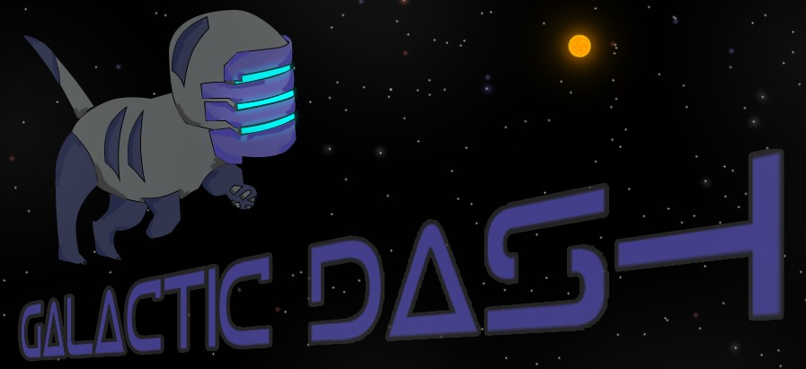

Galactic Dash
===
Galactic Dash is a mobile game made with Flash (ActionScript 3) inspired on [Tomb of the Mask](https://play.google.com/store/apps/details?id=com.playgendary.tom).

This was one of the first games we made (2016).

Most of the art was done by us, but you can find some ripoffs (Zarya from Overwatch as "dev team logo" for example).

## Repo

On the `project` directory you will find the Flash Builder project.

The `project/_DESIGN` directory contains the Flash project with the assets we used.

## Authors

Ignacio Gilardoni  
Lucas Fernandez Villafranca
